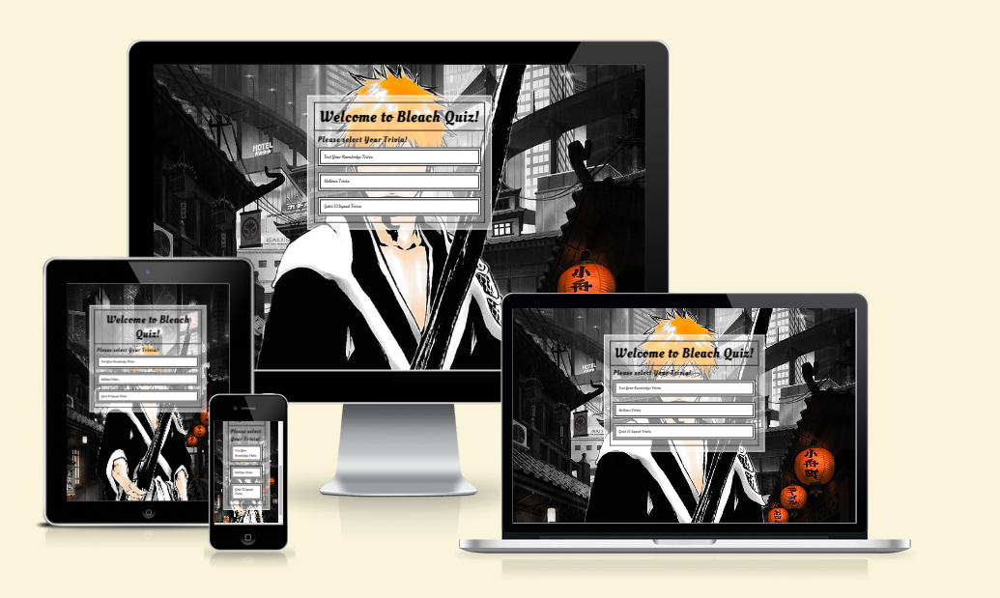
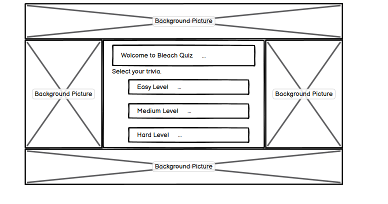
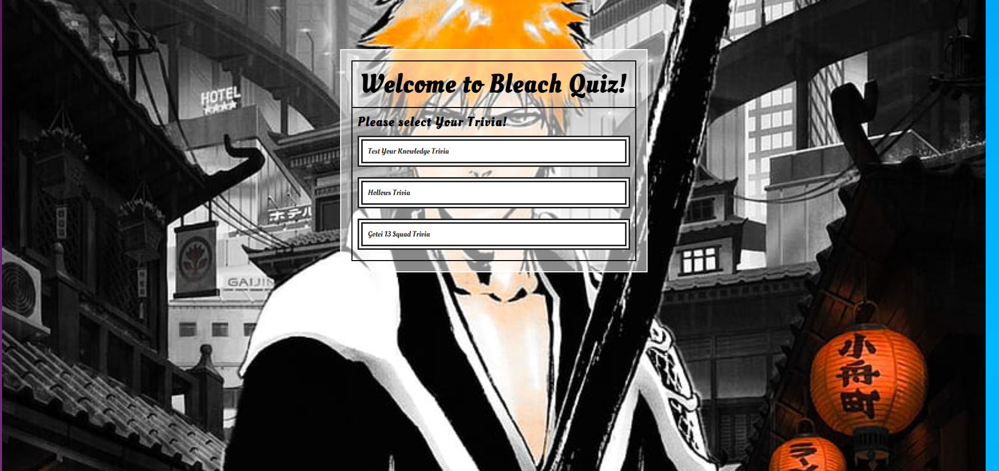
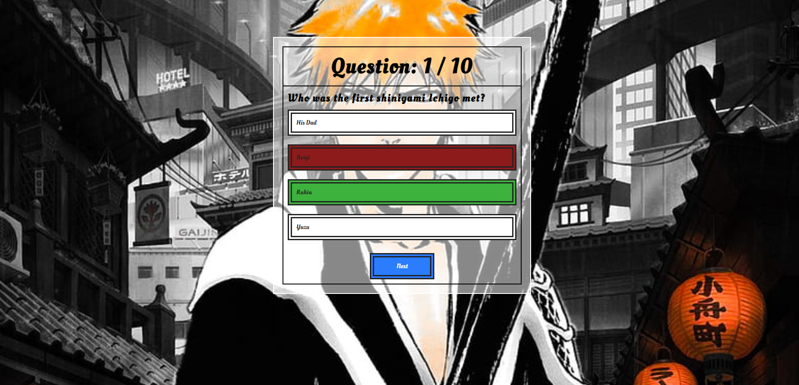
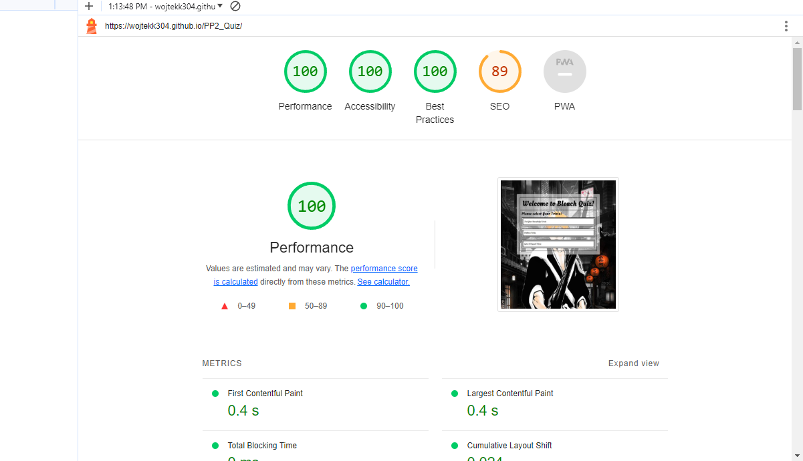

 
# Bleach Quiz Site

## It's a quiz site made to challenge your knowledge about Bleach Anime series.
* [User Experiences](#ux)
    * [Users Stories](#users-stories)
    * [Design](#design)
    * [Wireframe](#wireframe)
    * [Images](#images)
    * [Fonts](#fonts)
    * [Features](#features)

* [Testing](#testing)
    * [Validation](#validation)
    * [Issues](#issues)
    * [Deployment](#deployment)
    * [Lighthouse](#lighthouse)

* [Technology Used By Me](#technology-used-by-me)

* [Credits](#credits)
    * [Images](#images)
    * [Code](#code)
    * [Acknowledgments](#acknowledgments)

## You can See the website here [Bleach Quiz Site](https://wojtekk304.github.io/PP2_Quiz/)

## This site can be viewed in diffrent devices such as Desktop, Mobile,Tablet and Laptop as Demonstrated in the picture below. 

# UX

## Users Stories
Based on the users feedback I have collected I have identified the needs and actions for this website.

* The wbsite should allow to choose diffrent levels of dificulty depending on the user knowledge.
* The background should include a pciture of the main character.
* The colour scheme should be consistent.
* User should get a result at the end of the quiz.
* user should clearly see when they have made a mistake and what is the right answear.
## Design 
For my website I have used mostly 3 colors for the background I used #ffffff White ,for the borders I used black #202020 and for the other text I used Grey #474949

## Wireframe
I have created wireframe for my website before starting to code it as It is easier for me to have the website layout planned out before I started. You can see the wireframes below it a  simple wireframe as it looks simillar on all devices.

### Home Page

## Images 
I have used high quality pictures, that I found online.

## Fonts
I mostly used Oleo Script Cursive which I have Imported it from google fonts webpage.

## Features
I have included one main pages on the website.

* Home Page

Home page have a main picture with a message.

On the website there is a quiz which you can see on the photo being used.

## Testing
I have tested my website everytime I have added new line of code of html css and Javascript.
I have done that by saving my code and preview it in local server from gitpod,if everything was ok I would then continue with my work If I have found any error in responsivness of my website I would always correct it before I continue.

### Validation
I have validate my code by using w3c html and css validators and I used validatejavascript for Javascript., there was no errors reported on any of the code.

### Issues
The issue I have encounter is me being demotivated to finish the project.
### Deployment
I have used Github Pages to Deploy my website.

### Lighthouse
I have used Lighthouse to determinate performance,accessability,best practices and SEO.

# Technology Used By Me

* HTML
* Javascriptvalidator
* CSS
* w3c Validator
* Balsamiq Wireframe
* Github and Gitpod
* Google Fonts
* Google Lighthouse
* Cloud Convert

# Credits

### Images
All my images used in the gallery and main picture were sourced from pexels.com and google pictures which is a free source website for images.

### Code
I have used a code for my gallery section and from w3c school website https://www.w3schools.com/ and later have edited it myself.
Code institute All other code was sourced from learning it though the course content.

### Acknowledgments

I would like to thank my class and my cohort facilitator for all the help provided.
